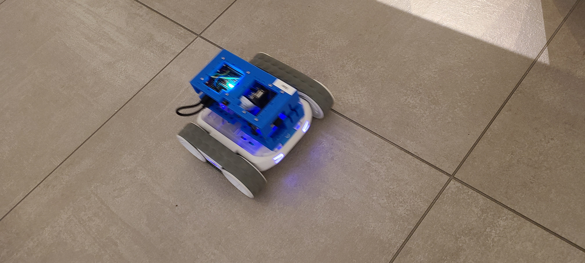

# blue-rvr

<<<<<<< HEAD
`blue-rvr` is a bash cli fork of [Sphero RVR SDK](https://github.com/sphero-inc/sphero-sdk-raspberrypi-python) built on [awesome-bash-cli](https://github.com/kamangir/abcli). Follow [these instructions](https://github.com/kamangir/blue-bracket/blob/main/designs/blue1.md) to build a low-cost rover that carries a camera, runs deep learning vision models through python and bash, and is cloud-connected - [more here](https://arash-kamangir.medium.com/camera-code-action-9e6f8c50a272).
=======
`blue-rvr` is a [bolt](https://github.com/kamangir/bolt2) plugin for, and a fork of, [Sphero RVR SDK](https://github.com/sphero-inc/sphero-sdk-raspberrypi-python). Follow [these instructions](https://github.com/kamangir/blue-bracket/blob/main/designs/blue1.md) to build a low-cost rover that carries a camera, runs deep learning vision models through python and TensorFlow, and is cloud-connected - [more here](https://arash-kamangir.medium.com/camera-code-action-9e6f8c50a272).
>>>>>>> 671608fd8029b948907b31ded66fa84530fa519f
